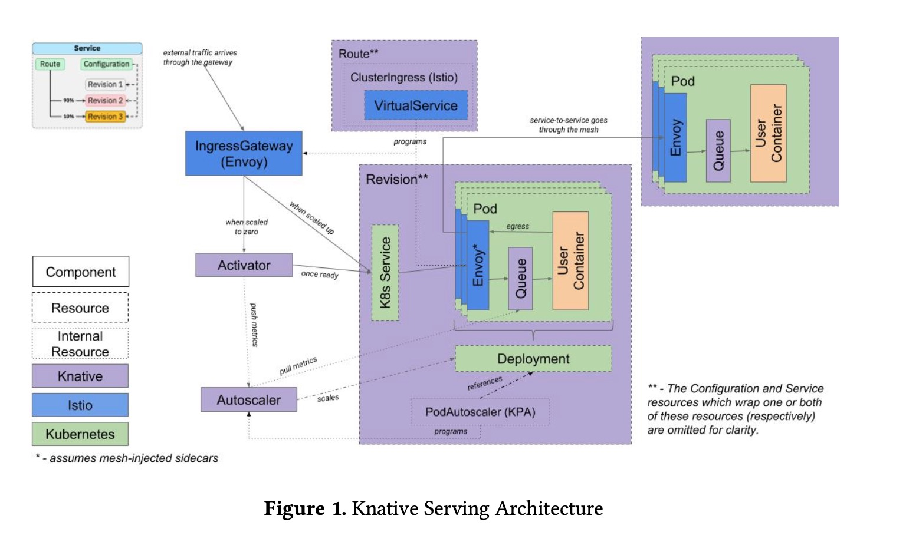

# Knative Serving on cloud-based Kubernetes


This repository can be re-used in subsequent projects as the initial stage of a live test bed to leverage the feaures of 
[Knative project](https://knative.dev/) (sponsored by Google) for serverless workloads: it is implemented on Google Cloud Platform (GCP) and Amazon Web Services (AWS)
via a fully automated Github workflows (see files [gcloud-gke-knative.yml](https://github.com/didier-durand/knative-on-cloud-kubernetes/blob/master/.github/workflows/gcloud-gke-knative.yml) 
and [aws-eks-knative.yml](https://github.com/didier-durand/knative-on-cloud-kubernetes/blob/master/.github/workflows/aws-eks-knative.yml))

This workflow creates a standard Kubernetes cluster on the cloud (either [Google Kubernetes Engine - GKE](https://cloud.google.com/kubernetes-engine) 
or [Amazon EKS](https://aws.amazon.com/eks/)). When the cluster is up, the workflow deploys the required Knative components and dependencies. Then, 
it rolls out a couple of Knative mock-up Docker services, validates their proper unitary functioning. Finally, it checks the scalability feature of Knative before termination via deletion 
of the deployed services and of the cluster.

As per [Knative documentation](https://knative.dev/docs/): "*Knative extends Kubernetes to provide a set of middleware components that are 
essential to **build modern, source-centric, and container-based applications that can run anywhere: on premises, in the cloud, or even in a 
third-party data center**. Each of the components under the Knative project attempt to identify common patterns and codify the best practices 
that are shared by successful, real-world, Kubernetes-based frameworks and applications.*".

So, two different containers are deployed on Knative: their proper execution is validated. The *[autoscale-go](https://knative.dev/v0.16-docs/serving/autoscaling/autoscale-go/)* 
image allows requests with parameters to consume more or less cpu and  memory check via query specific query parameters while 
*[helloworld-go](https://knative.dev/v0.17-docs/serving/samples/hello-world/helloworld-go/)* Docker image is limited to a unique and trivial 
response. We deploy helloworld-go with official [Knative client (kn)](https://github.com/knative/client) with minimal command-line options 
to demonstrate as easy as it can get for the developer: *'kn service create <SERVICE_NAME> --image-nname <IMAGE_NAME> --env <ENV_VARS_TO_SET>'*. 
But, a rich set of deployment options is provided as per [reference documentation](https://github.com/knative/client/blob/master/docs/cmd/kn_service_create.md). 
The autoscale-go service is deployed via a YAML file describing a Knative service.

The outcome of the recurring executions of the workflow and all the messages produced by those runs can be checked in the [Actions tab](https://github.com/didier-durand/knative-on-cloud-kubernetes-private/actions)
 of this repository. Also, the logs of any execution can be downloaded as text files via "download log archive" of the job dashboard for 
 further analysis. The workflow is executed at least weekly via Github's cron to make sure that it remains fully operational.

[Google Cloud Run](https://cloud.google.com/run) is Google's own implementation of the Knative stack ([with some limitations](https://ahmet.im/blog/cloud-run-is-a-knative/)), 
integrated with other services of GCP. But, this workflow demonstrates how to implement Knative on a raw Kubernetes cluster when a fully controlled 
implementation is desired.

(Current version of this repository is limited to implementation Knative Serving)

## Why Knative ?


As said above, Knative, OSS project sponsored by Google is implemented on GCP as service [Cloud Run](https://cloud.google.com/run) and integrated 
with the other services (logging, monitoring, iam, etc.) of the platform. It is very easy to use: check out "Deploy to Cloud Run" of our other 
repository collating GitHub-based CI/CD workflows.

<p align="center"></p>

But, if your workloads run elsewhere (on premise, other public cloud, etc.) or if you desire to avoid lock-in with a specific vendor and you still 
want to enjoy the benefits of serverless: the Serving block (see its archiecture in Figure 1 - source: [N. Kaviani & al](https://www.researchgate.net/publication/336567672_Towards_Serverless_as_Commodity_a_case_of_Knative)) 
of Knative delivers horizontal scalability, resiliency and deep observability for your application services by leveraging those same core 
characteristics of Kubernetes. But, it abstracts them through a [CLI named "kn"](https://github.com/knative/client/blob/master/docs/cmd/kn_service.md). 
Several versions of the same service can be active simultaneously and Knative can organize fractional routing between them to allow incremental 
rollout of new versions of the application.

Via the setup of [Prometheus](https://prometheus.io/), Knative can deliver exhaustive metrics, accessible through [Grafana](https://grafana.com/). 
Additionally, Knative implements [fluentd](https://www.fluentd.org/)to collect logs, make them accessible via [Kibana](https://www.elastic.co/kibana) 
or centralize them in a global logger like [Google Cloud Logging](https://cloud.google.com/logging). Also, traces of dialog between the service 
and its clients can also be collected via the setup of either [Zipkin](https://zipkin.io/) or [Jaeger](https://www.jaegertracing.io/). So, added 
to the use of [Istio](https://istio.io/) in the core implementation of Knative, the full spectrum of observability is thoroughly covered 
to allow high QoS at scale.

Knative is solely focused on those serverless workloads, which are "autonomous": they rely on single and independent containers to deliver their 
service.  Clearly, it doesn't cover the full spectrum of large-scale and sophisticated applications relying on additional services in 
other containers to run properly. But, for well-designed applications, a fair amount of their services can usually be implemented through Knative 
to obtain optimal efficiency: they will benefit from the advantages (again scalability, resiliency, etc.) of the core underlying Kubernetes 
infrastructure, used by the other parts of the application, without the need to develop the sophisticated configuration required to be a good K8s 
citizen.

## Autoscaling with Knative 

Section "Scalability test" below demonstrates the automated scaling delivered as a core feature of Knative: the  autoscaing algorithm is detailed 
on [Knative Autoscaling page](https://knative.dev/v0.15-docs/serving/samples/autoscale-go/#algorithm) and [Knative Serving Autoscaling System](https://github.com/knative/serving/blob/master/docs/scaling/SYSTEM.md). 
The initial *'kubectl get pods -n default'* 
demonstrates that the workload containers for autoscale-go was scaled down to zero due to initial inactivity. 

After 90s of http traffic maintaining 350 requests (as per [hey](https://github.com/rakyll/hey) command line) in parallel, the final *'kubectl get pods -n default'* shows that 
5 autoscale-go additional pods (for a total of 6) autoscale-go pods were launched by Knative to sustain the demand because autoscale-go can 
be parametrized to generate resource-demanding workloads (here biggest prime number under 10'000 and 5 MB memory consumption).

In comparison, 200k requests to helloworld-go are then executed again with hey. The throughput gets much higher (1'420 qps) because helloworld-go 
responses don't require much resources at all.  They last 390 seconds in total with an average throughput 
of 1'280 requests per second. For that purpose, as per final *'kubectl get pods -n default'*, Knative didn't scale up at all: a single pod is sufficient.

**NB**: for the histogram of response times, hey measures the full round-trip time between the Github CI/CD platform on Microsoft Azure datacenters 
and Google GCP datacenters because hey is run on GitHub while Knative is hosted on GKE.

## Steps of Github workflow

1. checkout the project from git repository in CI/CD runner provided by Github
2. setup the gcloud SDK with proper credentials to interact with GCP services
3. get gcloud and info version (if needed for debugging)
4. cleanup existing GKE cluster of previous run (if any)
5. create fresh GKE cluster with default add-ons for this run. The additional parameters allow cluster autoscaling between 1 and 10 nodes of instance type [n1-standard-4](https://cloud.google.com/compute/docs/machine-types).
6. *'gcloud container clusters get-credentials'* updates kubeconfig file with appropriate credentials and endpoint information to make kubectl usable with the newly created cluster. 
7. install Istio operator (an implementation of [standard K8s Custom Resource Definition (CRD)feature](https://kubernetes.io/docs/concepts/extend-kubernetes/api-extension/custom-resources/). This install is done via istioctl, whose nightly build is downloaded on the fly to proceed. We check - via kubectl + grep - the presence of expected services and pods.
8. Install the K8s CRD for Knative Serving feature block
9. Install the core components for Knative Serving feature block
10. Install the Istio controller for Knative Serving feature block
11. Check if full setup of GKE + Istio + Knative is working properly. We check - via kubectl + grep - the presence of expected services and pods.
12. Install a test Go workload coming from [Knative tutorial](https://knative.dev/docs/serving/getting-started-knative-app/)
13. Deploy the tutum/hello-world image as a Knative workload and use an http request to validate its proper functioning
14. Delete the cluster and all its resources created for this execution

## Setup for forks

To fork and run this project in your own Github account, you only need to:

- **GCP**: Create a test project in your GCP account and define it as a Github secret named ${{ secrets.GCP_PROJECT }} in workflow YAML. Define a service account in GCP IAM with Project Owner role (to make security definitions simpler), download its secret key and define the value of a Github
 secret named ${{ secrets.GCP_SA_KEY }} with the downloaded json.
- **AWS**: Define a user in AWS IAM with full admin rights (to make security definitions simpler), download its access key and secret key to define 2 secrets ${{ secrets.AWS_ACCESS_KEY_ID }} and ${{ secrets.AWS_SECRET_KEY }}. Finally, define the region that you want to work in as ${{ secrets.AWS_REGION }}
## Scalability test

See above for some comments

### results with autoscale-go
```
 run hey:

Summary:
  Total:	90.1358 secs
  Slowest:	3.1309 secs
  Fastest:	0.1320 secs
  Average:	0.1411 secs
  Requests/sec:	353.9438
  
  Total data:	3189679 bytes
  Size/request:	99 bytes

Response time histogram:
  0.132 [1]	|
  0.432 [31852]	|■■■■■■■■■■■■■■■■■■■■■■■■■■■■■■■■■■■■■■■■
  0.732 [0]	|
  1.032 [0]	|
  1.332 [0]	|
  1.631 [0]	|
  1.931 [0]	|
  2.231 [0]	|
  2.531 [0]	|
  2.831 [13]	|
  3.131 [37]	|


Latency distribution:
  10% in 0.1336 secs
  25% in 0.1352 secs
  50% in 0.1364 secs
  75% in 0.1373 secs
  90% in 0.1390 secs
  95% in 0.1407 secs
  99% in 0.1506 secs

Details (average, fastest, slowest):
  DNS+dialup:	0.0001 secs, 0.1320 secs, 3.1309 secs
  DNS-lookup:	0.0000 secs, 0.0000 secs, 0.0016 secs
  req write:	0.0000 secs, 0.0000 secs, 0.0007 secs
  resp wait:	0.1410 secs, 0.1320 secs, 3.0980 secs
  resp read:	0.0001 secs, 0.0000 secs, 0.0015 secs

Status code distribution:
  [200]	31903 responses


get pods [after]: 
NAME                                                READY   STATUS        RESTARTS   AGE
autoscale-go-t2zm7-deployment-6446d97d5b-8mxwt      2/2     Running       0          90s
autoscale-go-t2zm7-deployment-6446d97d5b-d2f46      2/2     Running       0          87s
autoscale-go-t2zm7-deployment-6446d97d5b-dkgnd      2/2     Running       0          89s
autoscale-go-t2zm7-deployment-6446d97d5b-lvm6q      2/2     Running       0          89s
autoscale-go-t2zm7-deployment-6446d97d5b-njlnd      2/2     Running       0          87s
autoscale-go-t2zm7-deployment-6446d97d5b-xg89r      2/2     Running       0          89s
helloworld-go-rzznz-1-deployment-5b64869744-pq7hz   1/2     Terminating   0          4m58s
```
### results with helloworld-go

```
run hey:

Summary:
  Total:	140.7448 secs
  Slowest:	0.1092 secs
  Fastest:	0.0307 secs
  Average:	0.0350 secs
  Requests/sec:	1421.0119
  
  Total data:	4000000 bytes
  Size/request:	20 bytes

Response time histogram:
  0.031 [1]	|
  0.039 [189442]	|■■■■■■■■■■■■■■■■■■■■■■■■■■■■■■■■■■■■■■■■
  0.046 [9240]	|■■
  0.054 [1023]	|
  0.062 [157]	|
  0.070 [58]	|
  0.078 [21]	|
  0.086 [14]	|
  0.094 [3]	|
  0.101 [6]	|
  0.109 [35]	|


Latency distribution:
  10% in 0.0322 secs
  25% in 0.0339 secs
  50% in 0.0348 secs
  75% in 0.0355 secs
  90% in 0.0370 secs
  95% in 0.0387 secs
  99% in 0.0445 secs

Details (average, fastest, slowest):
  DNS+dialup:	0.0000 secs, 0.0307 secs, 0.1092 secs
  DNS-lookup:	0.0000 secs, 0.0000 secs, 0.0020 secs
  req write:	0.0000 secs, 0.0000 secs, 0.0027 secs
  resp wait:	0.0349 secs, 0.0307 secs, 0.0848 secs
  resp read:	0.0000 secs, 0.0000 secs, 0.0052 secs

Status code distribution:
  [200]	200000 responses


get pods [after]: 
NAME                                                READY   STATUS    RESTARTS   AGE
helloworld-go-rzznz-1-deployment-5b64869744-pq7hz   2/2     Running   0          3m28s
```
